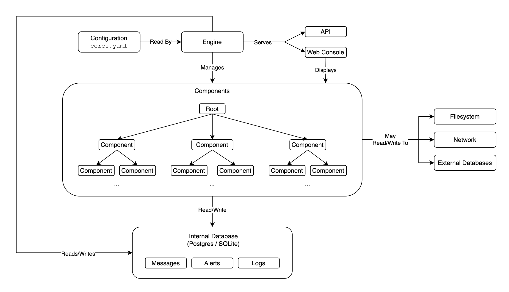

# Ceres

<!-- coverage:badge -->


<!-- /coverage:badge -->

Ceres is a Python framework for building data collection, monitoring, and device control systems. It takes ideas from service management tools like Docker and SystemD, scales them down, and applies them to Python objects called _components_.

Components are async Python classes that run concurrently, communicate through events, and persist their state in a database. They can connect to remote instruments over TCP, parse incoming data into structured records, emit alerts, and be managed through a CLI or web console.



## Where Ceres Is Used

Ceres was built at the University of Washington Applied Physics Laboratory (APL) to power instrument drivers for the [Ocean Observatories Initiative (OOI)](https://oceanobservatories.org/) Regional Cabled Array (RCA). Ceres runs on Linux, macOS, and Windows. In its current production deployment, it runs on physical Linux servers connected to oceanographic instruments (acoustic current profilers, pressure gauges, pH sensors, etc.), collecting and processing real-time data streams over TCP.

That said, Ceres is a general-purpose framework. It can manage any collection of async Python components that need lifecycle control, event handling, scheduling, and persistence.

## Quick Example

```python
from asyncio import sleep

from ceres import Component, routine


class Counter(Component):
    initial: int
    delta: int = 1

    @routine
    async def count(self) -> None:
        count = self.initial
        while True:
            self.system.log.info(count)
            await sleep(1)
            count += self.delta
```

```yaml
# ceres.yaml
database:
  type: sqlite
  path: ./local/database.sqlite

components:
  - name: counter-a
    class: counter.Counter
    arguments:
      initial: 5
  - name: counter-b
    class: counter.Counter
    arguments:
      initial: 100
      delta: -5
```

```sh
ceres run all             # Run both components in the foreground.
ceres service start       # Or run as a background service.
ceres status              # Check engine and component states.
ceres start all           # Start all components.
ceres enable all          # Auto-start components on engine startup.
ceres service stop        # Stop the background service.
```

## Documentation

- [Installing](installing.md): Install Ceres and set up a project.
- [Getting Started](getting-started.md): Build your first Ceres project from scratch.
- [Writing a Driver](writing-a-driver.md): Build an instrument driver with connections and data parsing.
- [Components](components.md): The core abstraction: routines, events, records.
- [Connections](connections.md): Connect to remote instruments and parse data.
- [Configuration](configuration.md): Full `ceres.yaml` reference.
- [CLI](cli.md): Command-line interface reference.
- [Deployment](deployment.md): Run Ceres as a production service.
- [Development](development.md): Set up a dev environment and contribute to Ceres.
- [API Reference](api-reference.md): Auto-generated Python API docs.
